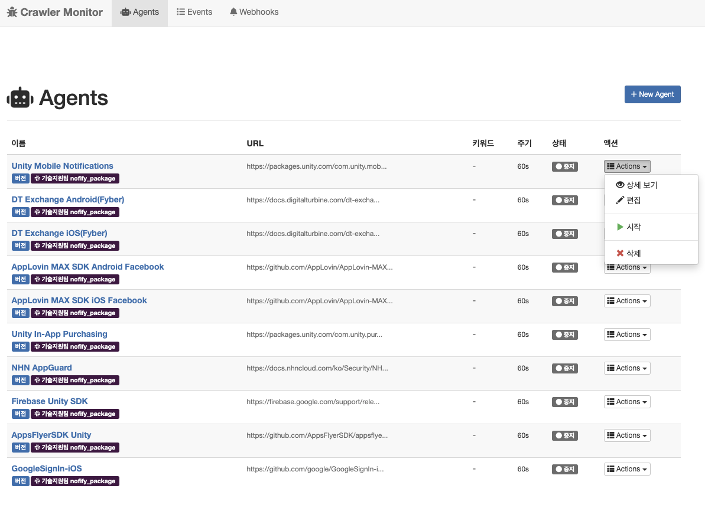
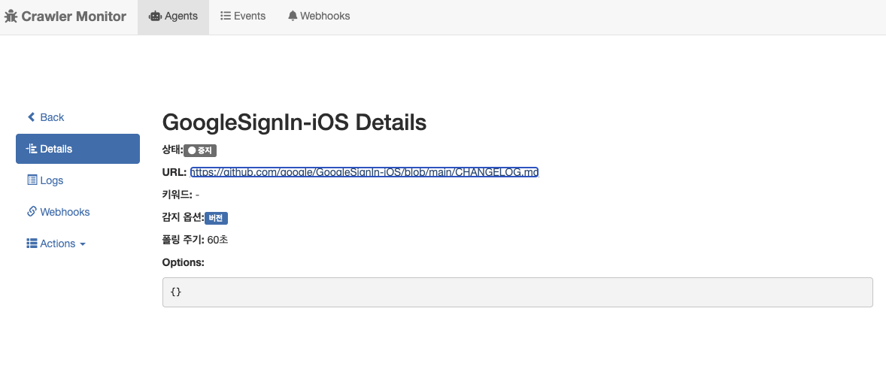
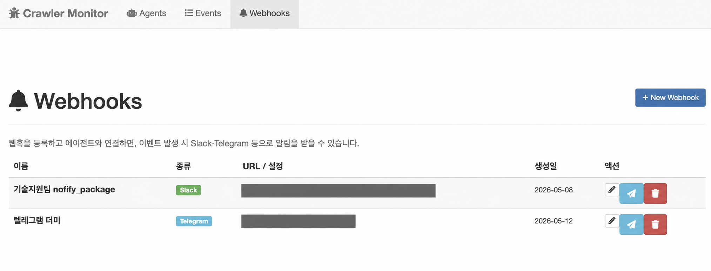
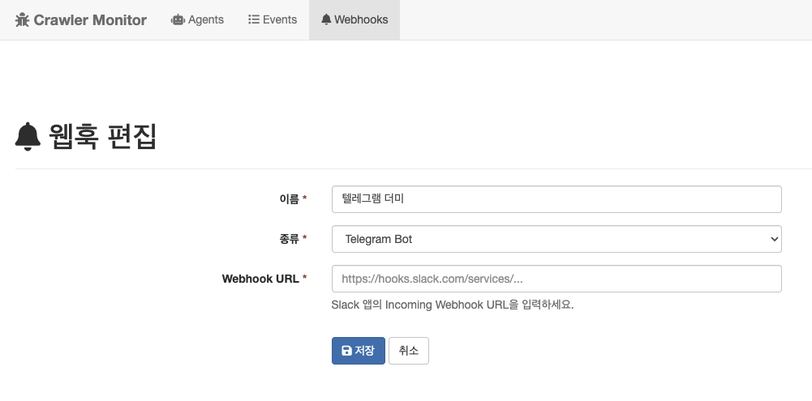
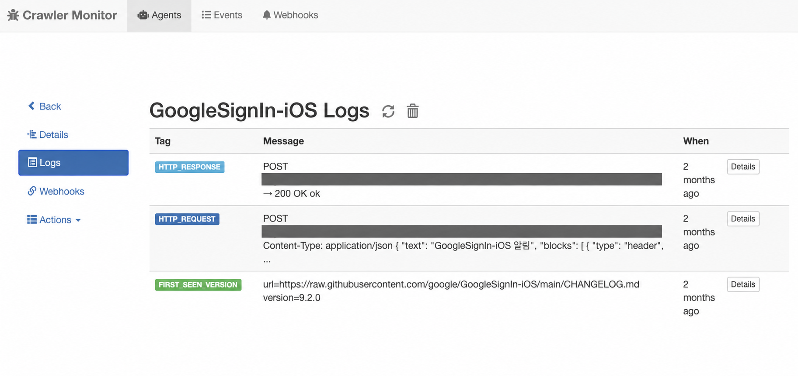
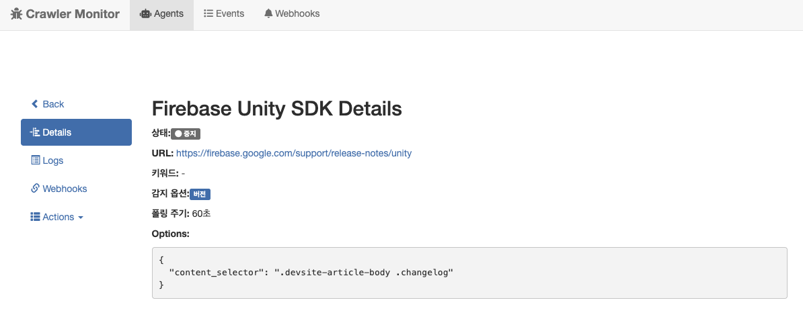
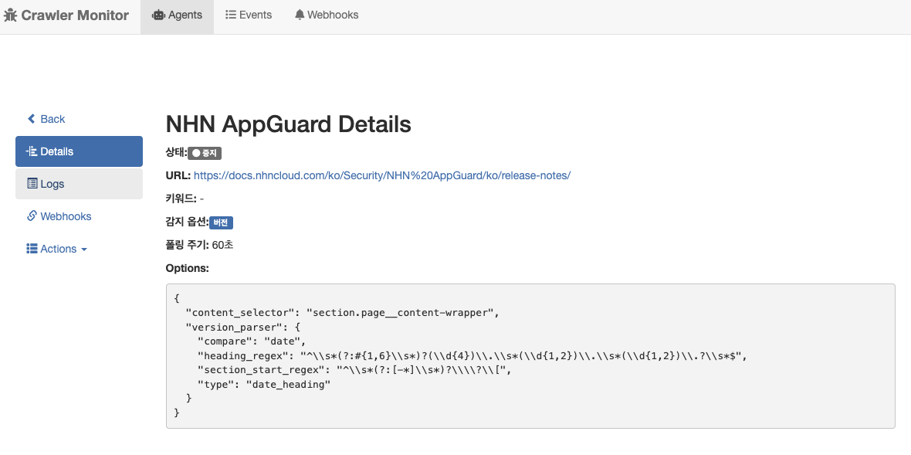

+++
title = "Go Crawler Notification: 웹 콘텐츠 변경 감지 및 알림 도구 개발기"
date = 2026-09-04T14:00:00+09:00
tags = ["go", "crawler", "slack", "monitoring", "templ", "chi"]
categories = ["Go"]
summary = "여러 SDK의 릴리즈 노트를 자동으로 확인하고 Slack으로 업데이트를 받아보기 위해 만든 도구. Huginn을 Go로 옮긴 클론을 참고해 AI 에이전트로 개발한 과정과 주요 기능을 소개한다."
draft = false
description = "여러 SDK의 릴리즈 노트를 자동으로 확인하고 Slack으로 업데이트를 받아보기 위해 만든 도구. Huginn을 Go로 옮긴 클론을 참고해 AI 에이전트로 개발한 과정과 주요 기능을 소개한다."
hero = "crawler-agent-actions.png"

[menu.sidebar]
name = "Go Crawler Notification: 웹 콘텐츠 변경 감지 및 알림 도구 개발기"
identifier = "go-crawler-notification"
parent = "go"
weight = 10
+++

## 왜 만들었나

모바일 게임에 사용하는 서드파티 SDK는 많고, 릴리즈 노트도 여러 사이트에 흩어져 있다. 업데이트가 있는지 매번 페이지를 열어 확인하는 일이 번거로웠다.

특히 Unity로 여러 플랫폼을 지원할 때는 **Unity 버전과 서드파티 SDK 사이의 빌드 호환성**을 함께 살펴야 한다. Android 타깃 API 수준을 올리거나 최신 Xcode에 대응할 때, 사용 중인 SDK의 지원 여부에 따라 관련 의존성도 함께 업데이트해야 할 수 있다. 이를 미리 확인하고 준비하지 않으면 빌드 문제를 뒤늦게 발견해 게임 배포 일정에 차질이 생길 수 있다.

그래서 **URL을 등록해 두면 새 버전과 변경 내역을 Slack으로 알려주는 도구**를 만들었다. 직접 찾아보는 수고를 줄이고, 팀에서도 업데이트 소식을 함께 받아보며 필요한 대응을 미리 준비하기 위해서다.

## 어떻게 만들었나

개발의 출발점은 오픈소스인 [Huginn](https://github.com/huginn/huginn)이었다.
이 아이디어에 잘 맞는 웹 UI/UX를 찾다가 Huginn을 발견했고, Go로 컨버팅해 클론 프로젝트를 만들었다.
이후 그 클론 프로젝트를 참고하여 AI 에이전트로 go-crawler-notification을 개발했다.

이 과정에서 첫 초안은 의도적으로 데스크톱 앱으로 만들었다. 아이디어를 데스크톱 앱 형태로 옮긴 것이었다.
현재 프로젝트는 웹 UI에서 감시 대상을 관리하고 알림을 설정하는 Go 웹앱이다.

## 어떤 기능이 있나

### 여러 SDK의 업데이트를 한곳에서 관리

Unity 패키지, Firebase, 광고 SDK처럼 여러 사이트에 흩어진 감시 대상을 **에이전트**로 등록한다. 목록에서 감시 URL과 점검 주기, 실행 상태, 연결된 알림 채널을 확인하고, Actions 메뉴에서 상세 보기·편집·모니터링 시작·중지·삭제를 수행할 수 있다.

*감시 대상의 상태를 확인하고 Actions 메뉴에서 관리한다.*

### 감시 대상별 설정 확인

에이전트마다 감시 URL과 점검 주기를 지정하고, 필요하면 키워드도 설정할 수 있다. 상세 화면에서는 현재 적용된 감지 방식과 설정을 확인한다.

아래 GoogleSignIn-iOS 에이전트는 GitHub의 CHANGELOG를 대상으로 60초마다 버전을 확인하도록 설정한 예시다. 화면을 촬영한 시점에는 모니터링을 중지한 상태다.

*감시 URL, 버전 감지 설정과 점검 주기를 확인한다.*

### 알림 받을 채널 연결

웹훅을 등록하고 에이전트와 연결하면 감지 결과를 Slack이나 Telegram으로 받을 수 있다. 웹훅 목록에서 알림 대상을 관리하고, 테스트 발송으로 연결 설정을 확인할 수 있다.

Slack 알림에는 새 버전과 해당 변경 내역, 원문 링크를 담았다. 팀 채널에서 업데이트 내용을 확인하고, 자세한 내용이 필요할 때 원문으로 이동할 수 있도록 했다.

*등록한 Slack·Telegram 알림 대상을 관리한다. 웹훅 주소와 Chat ID는 가렸다.*

웹훅 편집 화면에서는 이름과 유형, 연결 주소를 수정한다. 저장한 웹훅은 에이전트에 연결해 알림 대상으로 사용한다.

*웹훅의 이름과 연결 설정을 편집한다.*

### 감지와 발송 결과 확인

에이전트별 로그에서는 처음 확인한 버전과 웹훅 요청·응답을 살펴볼 수 있다. 알림이 예상대로 오지 않을 때 감지 기록과 발송 기록을 함께 확인하는 용도로 사용한다.

아래 화면에서는 GoogleSignIn-iOS의 `9.2.0` 버전을 처음 확인한 기록과 Slack 웹훅 요청에 대한 `200 OK` 응답을 볼 수 있다. 감지 이후 알림 요청까지 처리됐는지 확인할 수 있다.

*버전 확인과 웹훅 발송 기록을 함께 살펴본다. 웹훅 주소는 가렸다.*

## 트러블슈팅

### 사이트마다 다른 릴리즈 노트 형식

릴리즈 노트는 대체로 버전과 변경 내역을 나열하지만, 실제 문서 구조는 사이트마다 달랐다. GitHub의 `.md` 파일처럼 본문을 바로 읽을 수 있는 경우도 있고, 메뉴와 다른 내용이 섞인 웹페이지에서 필요한 부분만 골라야 하는 경우도 있었다.

**Firebase Unity SDK**는 웹페이지 안에서 변경 내역이 있는 영역만 읽도록 `content_selector`를 지정했다. 페이지 전체 대신 릴리즈 노트 본문에 집중하도록 한 것이다.

*Firebase 페이지에서 변경 내역을 읽을 영역을 지정했다.*

**NHN AppGuard**는 날짜를 기준으로 변경 내역이 정리되어 있어, 본문 영역과 함께 날짜 제목을 인식하고 비교하는 규칙을 설정했다. 같은 감지 방식을 모든 사이트에 적용하기보다, 에이전트별 옵션으로 문서 형식의 차이를 처리했다.

*본문 영역과 날짜 기반 감지 규칙을 함께 설정했다.*

> `.md`가 아닌 웹페이지라고 모두 동적 렌더링인 것은 아니다. 처음 받은 HTML에 본문이 있으면 필요한 영역을 골라 읽을 수 있지만, JavaScript 실행 후 내용이 나타나는 페이지는 원문 URL이나 별도의 브라우저 처리가 필요하다. 본문 영역을 지정하는 것만으로 동적 렌더링까지 해결되지는 않는다.

## 참고

- [Huginn — 프로젝트의 출발점](https://github.com/huginn/huginn)
- [Slack Incoming Webhooks — 알림 연동](https://docs.slack.dev/messaging/sending-messages-using-incoming-webhooks/)
- [Telegram Bot API — 봇 메시지 발송](https://core.telegram.org/bots/api)
