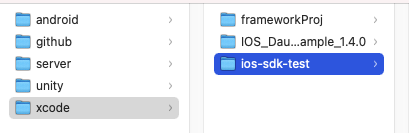
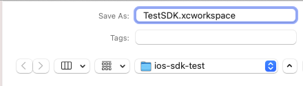
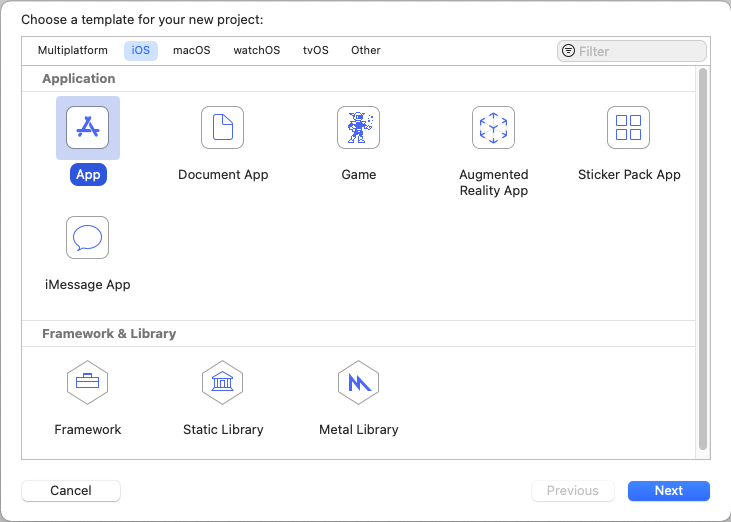
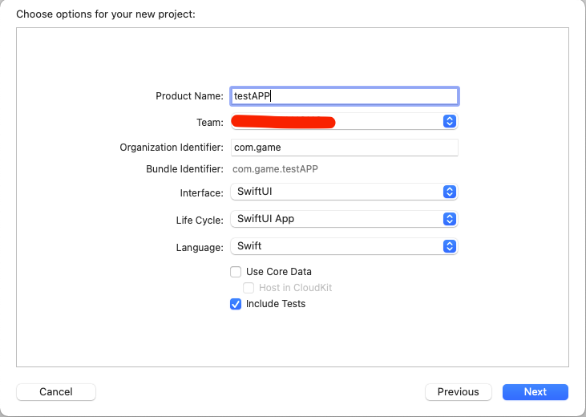
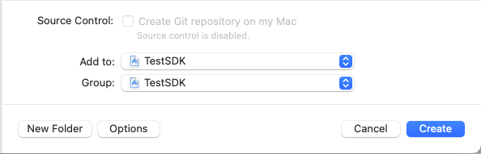
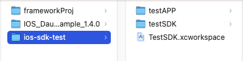

Workspace 를 생성하여 라이브러리와 앱 프로젝트를 생성하는 방식.

1. 우선 빈폴더를 만들고 프로젝트 이름을 정합니다.

   

2. **File > New > Workspace**...을 클릭합니다. Workspace 이름을 지정하고 **Save**.

   

3. **File > New > Project...**을 클릭합니다.

   

   

   먼저 앱 프로젝트를 생성하겠습니다.(순서는 상관없음)

   

   

   

   Product Name 을 정하고 Interface, Life Cycle, Language 각자 선호도에 맞게 선택합니다.

   

   

   

   Add to, Group 모두 타겟을 처음 만든 Workspace 를 선택해줍니다.(Framework 생성도 똑같음)

   Framework 도 동일하게 진행하게 되면 프로젝트 폴더구조는 다음과 같습니다.

   

   
