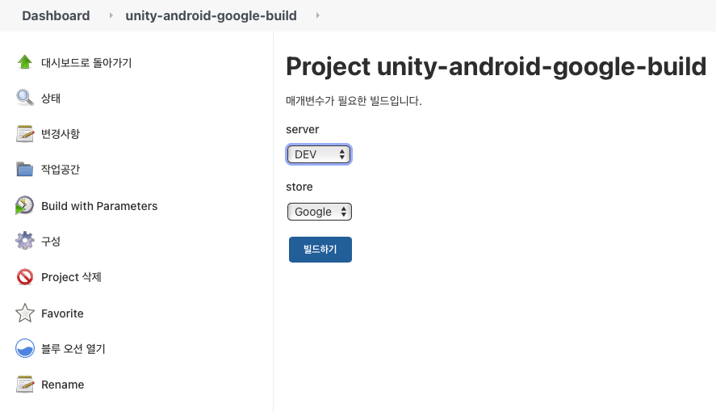

젠킨스에서 유니티빌드함수 호출시 파라미터 넘기기

## 빌드 파라미터를 받을 수 있게 구성에서 매개변수 설정



## shell script 로 유니티 함수 호출

```bash
-quit -batchmode -buildTarget Android -executeMethod BuildMenu.Buildmachine_TEST -server ${server} -store ${store}
```


## 유니티 함수내에서 파라미터 파싱

```csharp
using UnityEngine;
using UnityEditor;
using System;
using System.Collections.Generic;

public class BuildMenu : ScriptableObject
{
    static string[] SCENES = FindEnabledEditorScenes();

    private static string[] FindEnabledEditorScenes()
    {
        List<string> EditorScenes = new List<string>();

        foreach (EditorBuildSettingsScene scene in EditorBuildSettings.scenes)
        {
            if (!scene.enabled) continue;
            EditorScenes.Add(scene.path);
        }

        return EditorScenes.ToArray();
    }

    static string GetBuildServer()
    {
        string[] args = System.Environment.GetCommandLineArgs();
        string buildid = "server";
        for (int i = 0; i < args.Length - 1; i++)
        {
            if ("-server" == args[i])
            {
                buildid = args[i + 1];
                break;
            }
        }

        return buildid;
    }

    static string GetBuildStore()
    {
        string[] args = System.Environment.GetCommandLineArgs();
        string buildid = "store";
        for (int i = 0; i < args.Length - 1; i++)
        {
            if ("-store" == args[i])
            {
                buildid = args[i + 1];
                break;
            }
        }

        return buildid;
    }

    static string GetAndroidOutputFile()
    {
        string output = string.Format("{0}/{1}_{2}.apk", "AndroidBuild",
                                                     GetBuildStore(),
                                                     GetBuildServer());
        return output;
    }

    [UnityEditor.MenuItem("BuildMenu/TEST", false, 3001)]
    static void Buildmachine_TEST()
    {
        PrepareAndroidBuild("com.test.app");
        PerformAndroidBuild(GetAndroidOutputFile(), "", false);
    }

    static void PrepareAndroidBuild(string bundleID)
    {
        PlayerSettings.Android.keystoreName = "user.keystore";
        PlayerSettings.SetApplicationIdentifier(BuildTargetGroup.Android, bundleID);
        PlayerSettings.Android.keyaliasName = "";
        PlayerSettings.keystorePass = "";
        PlayerSettings.keyaliasPass = "";
        PlayerSettings.bundleVersion = "";
        PlayerSettings.Android.bundleVersionCode = 20;
    }

    static string PerformAndroidBuild(string output, string define, bool isDev)
    {
        PlayerSettings.SetScriptingDefineSymbolsForGroup(BuildTargetGroup.Android, define);

        BuildPipeline.BuildPlayer(SCENES, output, BuildTarget.Android, isDev ? BuildOptions.AutoRunPlayer : BuildOptions.None);
        return output;
    }
}
```

---

[기술 블로그에서 원문 보기](https://coolishbee.github.io/techblog/unity/unity-build-machine-shell/)
