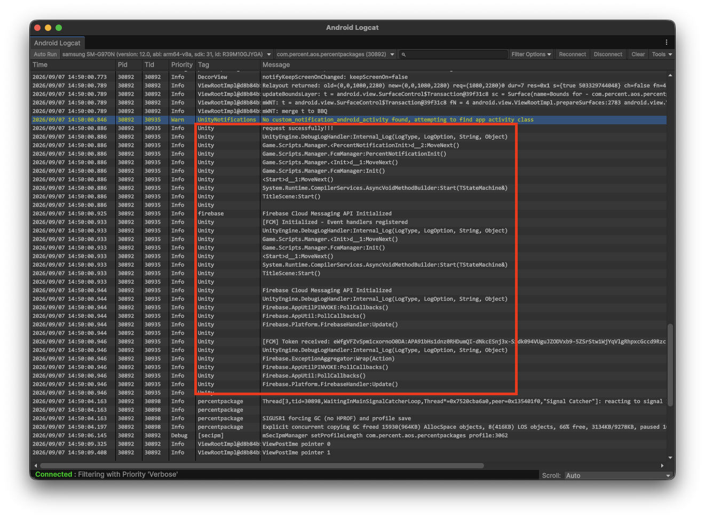
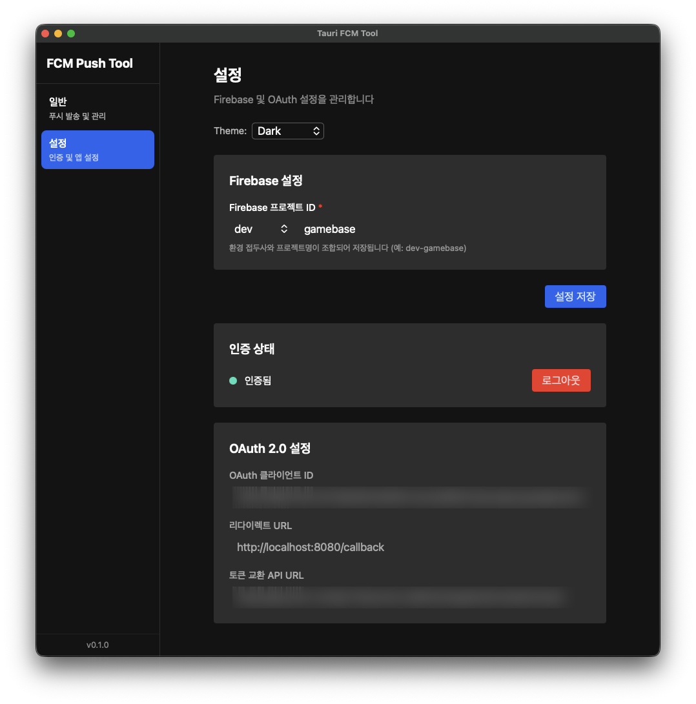

+++
title = "Unity에서 FCM 사용하기: Android·iOS 연동과 트러블슈팅"
date = 2026-09-07T00:00:00+09:00
tags = ["unity", "fcm", "android", "ios", "push-notification"]
categories = ["Unity"]
summary = "사내 서버 프레임워크 Perbase에 토픽 발송을 추가하며 Unity의 FCM 설정, Tauri 테스트 툴 개발, 서버 연동과 푸시 수신을 검증한 기록."
draft = false
description = "사내 서버 프레임워크 Perbase에 토픽 발송을 추가하며 Unity의 FCM 설정, Tauri 테스트 툴 개발, 서버 연동과 푸시 수신을 검증한 기록."
hero = "fcm-push-tool-01.png"

[menu.sidebar]
name = "Unity에서 FCM 사용하기: Android·iOS 연동과 트러블슈팅"
identifier = "unity-fcm-integration"
parent = "unity"
weight = 80
+++

## 개요

사내에서 개발한 서버 프레임워크인 Perbase의 푸시 시스템에 토픽 발송 기능을 추가하면서 Unity 클라이언트 설정부터 서버 발송까지 전체 흐름을 점검했다. Android와 iOS에서 메시지를 받아보고, Android에서는 헤드업 알림과 사운드가 정상적으로 동작하는지도 확인했다.

반복 테스트를 위해 Tauri 기반의 FCM Push Tool을 만들었다. 토큰과 토픽을 지정해 메시지를 보내고, 요청 내용과 발송 결과를 화면에서 확인할 수 있도록 했다.

## Unity에서 FCM 사용하기

Unity 프로젝트에 Firebase 설정 파일과 Firebase Messaging SDK를 추가하고, Firebase 초기화 후 토큰 수신과 메시지 수신 이벤트를 연결한다. Android와 iOS의 기본 설정은 [Firebase Unity 가이드](https://firebase.google.com/docs/cloud-messaging/unity/get-started)를 따른다.

Android에서는 알림 권한과 Notification Channel을 설정한다. iOS에서는 Push Notifications capability와 Firebase의 APNs 인증 설정을 준비하고, 알림 표시와 사운드 사용 권한을 요청한다.

발송 대상은 두 가지로 나뉜다.

- **토큰 발송:** 특정 앱 인스턴스에 메시지를 보낸다. 테스트 기기 한 대에서 수신 여부를 확인할 때 사용한다.
- **토픽 발송:** 같은 토픽을 구독한 앱들에 메시지를 보낸다. 클라이언트에서 먼저 해당 토픽을 구독해야 한다.



_Logcat에서 Firebase 초기화와 FCM 토큰 수신을 확인했다._

> Android 13 이상에서는 알림 권한 요청 팝업을 통해 사용자의 허용이 필요하다.  
> Android 12 이하에서는 기본적으로 알림이 허용되지만, 사용자가 설정에서 끌 수 있다.

## 토큰·토픽 발송 테스트 툴

클라이언트와 서버를 연동하면서 푸시를 반복해서 테스트해야 했다. 매번 요청을 직접 작성하는 수고를 줄이기 위해 **[Tauri 2](https://github.com/tauri-apps/tauri)와 Rust 기반의 데스크톱 앱**을 만들고, 화면은 **SvelteKit과 Svelte 5**로 구성했다.

주요 기능은 다음과 같다.

- 토큰·토픽 발송과 Android Channel ID 지정
- Firebase 프로젝트 및 OAuth 인증 설정
- 요청 JSON과 발송 결과 확인
- 메시지 템플릿 저장·불러오기 및 발송 이력 조회

이후 라이트·다크·시스템 테마를 추가했다.



_테스트에 사용할 Firebase 프로젝트와 인증을 설정한다._

### 토큰으로 발송하기

기기에서 받은 FCM 토큰을 입력해 단일 기기로 발송한다. 화면에서 요청 JSON과 FCM의 발송 응답을 확인하고, 기기에서 실제 알림이 도착했는지 점검했다.



### 토픽으로 발송하기

토픽 이름을 입력해 해당 토픽을 구독한 기기로 발송한다. 개별 토큰을 입력하지 않고 구독 대상을 묶어 테스트할 수 있다.



## Perbase 서버에서 FCM API 연동하기

테스트 툴로 FCM 요청을 확인한 뒤 Perbase 서버의 토픽 발송 기능을 검증했다. 서버의 FCM HTTP v1 호출은 OAuth 2.0 액세스 토큰으로 인증하며, 요청 본문의 `message`에 발송 대상과 플랫폼별 설정을 전달한다. [FCM 서버 인증 가이드](https://firebase.google.com/docs/cloud-messaging/auth-server)

아래는 `ko` 토픽 발송에 사용한 메시지 설정을 HTTP v1 요청 본문 형태로 정리한 예시다.

```json
{
  "message": {
    "topic": "ko",
    "notification": {
      "title": "[sound] ios test1",
      "body": "sound test 1"
    },
    "android": {
      "priority": "high",
      "notification": {
        "channel_id": "perbase_noti"
      }
    },
    "apns": {
      "headers": {
        "apns-priority": "10"
      },
      "payload": {
        "aps": {
          "sound": "default"
        }
      }
    }
  }
}
```

테스트 툴 화면의 JSON은 툴 자체의 입력 형식이며, 위 예시는 FCM HTTP v1으로 전달하는 형식이다. [FCM 메시지 명세](https://firebase.google.com/docs/reference/fcm/rest/v1/projects.messages)

### Android Channel ID

`channel_id`는 **앱에 미리 등록한 알림 채널을 선택하는 값**이다. 이 예시에서는 클라이언트에 `perbase_noti` 채널을 만들고, 서버에서도 같은 ID를 지정한다.

Android 8.0 이상에서는 채널이 알림의 중요도와 소리 같은 동작을 관리한다. 헤드업 알림에는 높은 채널 중요도인 `IMPORTANCE_HIGH`가 필요하며, 실제 표시는 사용자의 알림 설정에도 영향을 받는다. `android.priority: high`는 메시지 전달 우선순위이므로 채널 중요도와 별도로 확인해야 한다.

이미 생성한 채널의 중요도는 코드에서 같은 ID로 다시 등록해도 바뀌지 않는다. 설정을 수정한 뒤 테스트할 때는 기기에 저장된 채널 설정도 확인해야 한다. [Android 알림 채널 가이드](https://developer.android.com/develop/ui/views/notifications/channels)

### iOS `apns-priority`

`apns-priority`는 **APNs가 알림을 전달할 때 사용하는 우선순위**다.

- `10`: 즉시 전달을 요청한다.
- `5`: 기기의 전력 상황을 고려해 전달하며, 지연될 수 있다.

위 예시는 화면에 표시하는 알림이므로 `10`을 사용했다. 소리는 별도로 `aps.sound: "default"`를 지정해 기본 알림음을 요청한다. 우선순위 자체가 소리를 켜거나 즉시 수신을 보장하는 것은 아니다. 사용자에게 표시하지 않는 무음 백그라운드 알림은 우선순위 `5`를 사용한다. [Apple APNs 요청 가이드](https://developer.apple.com/documentation/usernotifications/sending-notification-requests-to-apns)

### 검증 결과

Perbase 서버 테스트프레임워크에서 유닛테스트를 완료했고, Percent Notification 패키지에 필요한 코드를 반영한 뒤 샘플앱에서 테스트했다.

확인한 항목은 다음과 같다.

- 서버 → FCM → 클라이언트의 전체 푸시 흐름
- 토큰 및 토픽 발송 메시지 수신
- Android Notification Channel 설정과 동작
- Android 헤드업 알림 노출 및 사운드 동작

<!-- Unity 버전 업그레이드에 따른 Android 빌드 트러블슈팅은 추후 작성한다. -->

## 참고

- [Unity에서 FCM 시작하기](https://firebase.google.com/docs/cloud-messaging/unity/get-started)
- [FCM 서버 인증 및 발송 요청](https://firebase.google.com/docs/cloud-messaging/auth-server)
- [FCM HTTP v1 메시지 명세](https://firebase.google.com/docs/reference/fcm/rest/v1/projects.messages)
- [Android 알림 채널 설정](https://developer.android.com/develop/ui/views/notifications/channels)
- [Android 13 이상 알림 권한](https://developer.android.com/develop/ui/views/notifications/notification-permission)
- [Apple APNs 알림 요청과 우선순위](https://developer.apple.com/documentation/usernotifications/sending-notification-requests-to-apns)
